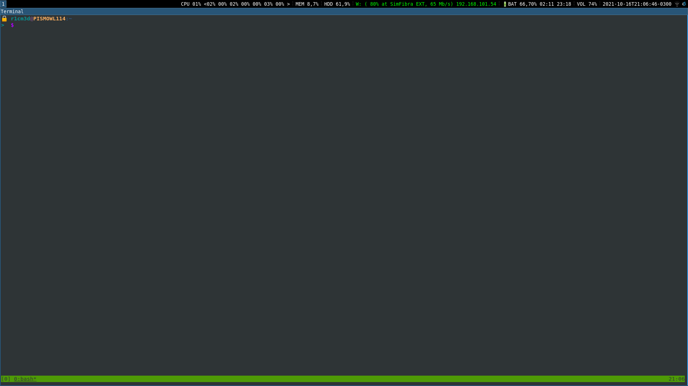

# dotfiles
It contains my configuration files (dotfiles). Besides that, it also has my own
functions, aliases and environment variables.

### Screenshot


## Table of Contents
* [dotfiles](#dotfiles)
* [How it works](#how-it-works)
* [Structure](#structure)
* [Installation](#installation)
* [Sensible Data](#sensible-data)
* [Colors setup](#colors-setup)


### How it works
It loads all files of each directory contained into `$CONFIGURATION/conf.d`. Those
directories are loaded in crescent order, thus the lower layer must have a lower
number.

For instance, `1-var.d` contains files that exports environment variables that
could be used for the underlying layers.

Each file must not depend on a structure that are contained in the same layer,
otherwise it could create a cyclic dependency.

### Structure
``` shell
.
├── conf.d
│   ├── 1-var.d
│   │   ├── color
│   │   ├── conf
│   │   ├── core
│   │   ├── docker
│   │   ├── path
│   │   ├── project.enc
│   │   ├── project.enc.gpg
│   │   ├── vault.enc
│   │   └── vault.enc.gpg
│   ├── 2-lib.d
│   │   ├── encrypt
│   │   ├── export_ps1
│   │   └── pass
│   ├── 3-func.d
│   │   ├── bash
│   │   ├── countdown
│   │   ├── date
│   │   ├── fc
│   │   ├── fl
│   │   ├── git
│   │   ├── logrole.enc
│   │   ├── logrole.enc.gpg
│   │   ├── metabase.enc
│   │   ├── metabase.enc.gpg
│   │   ├── pass
│   │   ├── punclo.enc
│   │   ├── punclo.enc.gpg
│   │   ├── rdp.enc
│   │   ├── rdp.enc.gpg
│   │   ├── sc
│   │   ├── str
│   │   ├── sys
│   │   ├── vpn.enc
│   │   └── vpn.enc.gpg
│   ├── 4-alias.d
│   │   ├── arc.enc
│   │   ├── arc.enc.gpg
│   │   ├── commands
│   │   ├── dir
│   │   ├── genamo
│   │   ├── git
│   │   ├── k8s
│   │   ├── keyboard
│   │   ├── pass
│   │   ├── project
│   │   ├── release
│   │   └── twofa
│   └── 5-exec.d
│       ├── bash_completion
│       ├── export_ps1
│       ├── shopt
│       └── tmux
├── dep
├── install
├── LICENSE
└── README.md
```

### Installation
Just run:
``` sh
./install
```

It will copy `.bashrc` to your user directory making a backup of it. It also
extracts `.mutt` configuration files.

### Sensible data
Files with `*enc` suffix, is ignored by git. If you need upload those files,
encrypt them using `encrypt` function. Only encrypted `*gpg` files should be
uploaded in the repo.

### Colors setup
To set up PS1 colors, edit the file `$VAR/color`

``` bash
vim $VAR/color
```

Just edit the variable that refers to property you want to change.
For instance, for change the **HOSTNAME** to bold+violet:

```  bash
HOSTNAME_COLOR=$BV
```

thereafter

``` bash
reload
```

To rerun bash environment