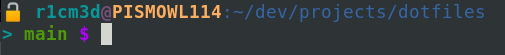

# dotfiles
It contains my configuration files (dotfiles). Besides that, it also has my own
functions, aliases and environment variables.

### Screenshot



## Table of Contents
* [dotfiles](#dotfiles)
* [How it works](#how-it-works)
* [Structure](#structure)
* [Installation](#installation)
* [Sensible Data](#sensible-data)
* [Colors setup](#colors-setup)


### How it works
It loads all files of each directory contained into `$CONFIGURATION/conf.d`. Those
directories are loaded in crescent order, thus the lower layer must have a lower
number.

For instance, `1-var.d` contains files that exports environment variables that
could be used for the underlying layers.

Each file must not depend on a structure that are contained in the same layer,
otherwise it could create a cyclic dependency.

### Structure
``` shell
.
├── LICENSE
├── README.md
├── conf.d
│   ├── 1-var.d
│   │   ├── acc.enc
│   │   ├── acc.enc.gpg
│   │   ├── android_id
│   │   ├── color
│   │   ├── conf
│   │   ├── core
│   │   ├── dev
│   │   ├── gpg
│   │   ├── gpgkey.enc
│   │   ├── gpgkey.enc.gpg
│   │   ├── hash.enc
│   │   ├── hash.enc.gpg
│   │   ├── path
│   │   ├── project.enc
│   │   ├── project.enc.gpg
│   │   ├── vault.enc
│   │   ├── vault.enc.gpg
│   │   ├── vpn.enc
│   │   ├── vpn.enc.gpg
│   ├── 2-lib.d
│   │   ├── encrypt
│   │   ├── export_ps1
│   │   └── pass
│   ├── 3-func.d
│   │   ├── auth.enc
│   │   ├── auth.enc.gpg
│   │   ├── awscli.enc
│   │   ├── awscli.enc.gpg
│   │   ├── bash
│   │   ├── card.enc
│   │   ├── card.enc.gpg
│   │   ├── countdown
│   │   ├── date
│   │   ├── fc
│   │   ├── fl
│   │   ├── gensftp
│   │   ├── git
│   │   ├── gk-git.enc
│   │   ├── gk-git.enc.gpg
│   │   ├── logdocker.enc
│   │   ├── logdocker.enc.gpg
│   │   ├── logql.enc
│   │   ├── logql.enc.gpg
│   │   ├── logrole.enc
│   │   ├── logrole.enc.gpg
│   │   ├── metabase.enc
│   │   ├── metabase.enc.gpg
│   │   ├── op
│   │   ├── pass
│   │   ├── pis-git-rel.enc
│   │   ├── pis-git-rel.enc.gpg
│   │   ├── prtitle
│   │   ├── punclo.enc
│   │   ├── punclo.enc.gpg
│   │   ├── sc
│   │   ├── tenantlist.enc
│   │   ├── tenantlist.enc.gpg
│   │   ├── tenantlisthomolog.enc
│   │   └── tenantlisthomolog.enc.gpg
│   ├── 4-alias.d
│   │   ├── arc.enc
│   │   ├── arc.enc.gpg
│   │   ├── authstat.enc
│   │   ├── authstat.enc.gpg
│   │   ├── commands
│   │   ├── coreext
│   │   ├── cpbwses
│   │   ├── db
│   │   ├── dir
│   │   ├── docker
│   │   ├── dockerd
│   │   ├── edauth.enc
│   │   ├── edauth.enc.gpg
│   │   ├── edawscli.enc
│   │   ├── edawscli.enc.gpg
│   │   ├── edcard.enc
│   │   ├── edcard.enc.gpg
│   │   ├── edclear.enc
│   │   ├── edclear.enc.gpg
│   │   ├── edlogql.enc
│   │   ├── edlogql.enc.gpg
│   │   ├── emerge
│   │   ├── genamo
│   │   ├── gh
│   │   ├── git
│   │   ├── gk.enc
│   │   ├── gk.enc.gpg
│   │   ├── k8s.enc
│   │   ├── k8s.enc.gpg
│   │   ├── keyboard
│   │   ├── nordlockermasterkey
│   │   ├── orggen
│   │   ├── pass
│   │   ├── project
│   │   ├── ps
│   │   ├── rdp.enc
│   │   ├── rdp.enc.gpg
│   │   ├── tutanota.enc
│   │   ├── tutanota.enc.gpg
│   │   ├── twofa
│   │   ├── vpn.enc
│   │   ├── vpn.enc.gpg
│   │   ├── wifi.enc
│   │   └── wifi.enc.gpg
│   ├── 5-exec.d
│   │   ├── bash_completion
│   │   ├── export_ps1
│   │   ├── shopt
│   │   └── tmux
│   └── 6-extfunc.d
│       └── git
├── darwin_kb_sc
│   ├── INSTRUCTIONS
│   ├── com.apple.symbolichotkeys.plist
│   └── pbs.plist
├── dep
├── i3
│   └── config
├── i3status
│   └── config
└── install
```

### Installation
Just run:
``` sh
./install
```

It will copy `.bashrc` to your user directory making a backup of it. It also
extracts `.mutt` configuration files.

### Sensible data
Files with `*enc` suffix, is ignored by git. If you need upload those files,
encrypt them using `encrypt` function. Only encrypted `*gpg` files should be
uploaded in the repo.

### Colors setup
To set up PS1 colors, edit the file `$VAR/color`

``` bash
vim $VAR/color
```

Just edit the variable that refers to property you want to change.
For instance, for change the **HOSTNAME** to bold+violet:

```  bash
HOSTNAME_COLOR=$BV
```

thereafter

``` bash
reload
```

To rerun bash environment
